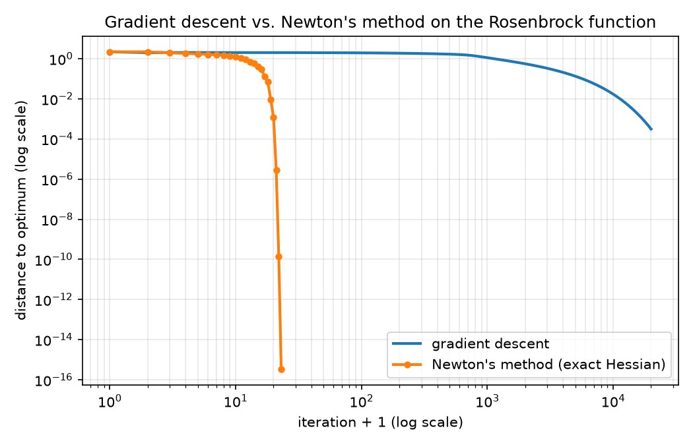
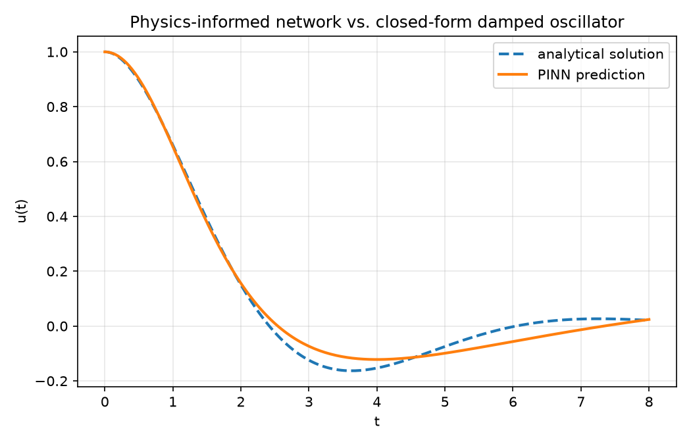
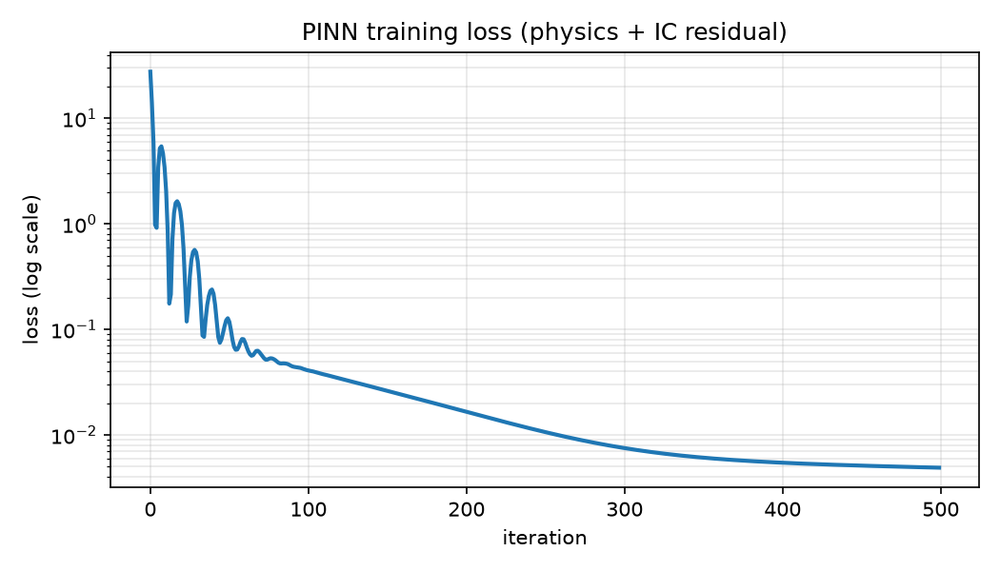
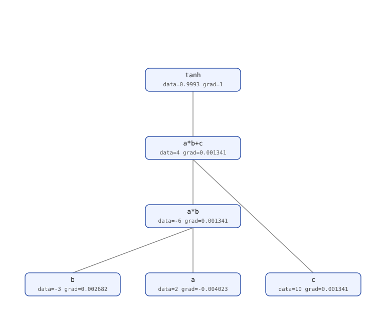

# hypergrad

**A from-scratch automatic differentiation engine that computes exact Hessians, not just gradients.**

[](https://github.com/athar-usama/hypergrad/actions/workflows/ci.yml)


Every well-known "build your own autograd" project, including Karpathy's [micrograd](https://github.com/karpathy/micrograd) and its many clones, implements reverse-mode-only automatic differentiation: it gets you a gradient, and that's it. Ask one of them for a second derivative and the honest answer is "you can't, not without an unstable finite-difference hack."

`hypergrad` is the same idea (a scalar computation graph, `.backward()`, under 300 lines between `core.py` and `dual.py`), with one difference: `Value` (reverse-mode) and `Dual` (forward-mode) are both written generically over any number-like type, so they compose with each other, in either nesting order, to any depth. That design choice makes two things possible that a first-order engine cannot do:

1. **Exact Hessians and Hessian-vector products**, in one backward pass, via forward-over-reverse mode ("Value-of-Dual").
2. **Training a network against a loss that itself requires a second derivative**, the physics-informed neural network (PINN) case below, via "Dual-of-Value".

Both are demonstrated below with runnable examples and measured output, not just asserted in prose.

## Why this is different from micrograd

| | micrograd (and clones) | hypergrad |
|---|---|---|
| Differentiation mode | reverse-mode only | reverse-mode **and** forward-mode, composable |
| Second derivatives | not supported (would need finite differences) | exact, via forward-over-reverse |
| Hessian-vector product cost | O(n) finite-difference evaluations, approximate | **1 backward pass**, exact |
| Can train a loss involving ∂²(output)/∂(input)² | no | yes (see the PINN example) |
| Core abstraction | `Value` wraps `float` | `Value` and `Dual` each wrap anything implementing `+ - * / **` (including each other) |

## Install

```bash
git clone https://github.com/athar-usama/hypergrad.git
cd hypergrad
pip install -e ".[dev]"
```

## Quickstart

```python
from hypergrad import Value, grad, hessian, hvp

def f(v):
    x, y = v
    return (1 - x) ** 2 + 100 * (y - x * x) ** 2  # Rosenbrock

x0 = [0.0, 0.0]
grad(f, x0)          # -> [-2.0, 0.0]              ordinary gradient
hessian(f, x0)        # -> [[2, 0], [0, 200]]        exact, full Hessian
hvp(f, x0, [1.0, 0.0])  # -> [2.0, 0.0]              exact Hessian-vector product, one backward pass
```

## Demo 1: Newton's method with an exact Hessian

```bash
python examples/newton_optimizer.py
# or, after pip install:
hypergrad demo newton
```

Gradient descent on the Rosenbrock function needs thousands of small steps because the valley is so ill-conditioned. Newton's method gets there in a handful, using the exact Hessian straight out of `hessian()` to rescale each step by the local curvature instead of guessing:

```
$ python examples/newton_optimizer.py
gradient descent :  20000 iterations -> x=[0.99986, 0.99972]   (hit the iteration cap, still converging)
Newton's method  :     22 iterations -> x=[1.00000, 1.00000]   (to float64 precision)
```



## Demo 2: a from-scratch Physics-Informed Neural Network

```bash
python examples/pinn_oscillator.py
# or:
hypergrad demo pinn
```

Trains a network `u(t; θ)` to satisfy the damped-harmonic-oscillator ODE `u'' + 2ζω₀u' + ω₀²u = 0` by minimizing the ODE residual itself, with no labeled `(t, u)` data at all. That loss needs `u''(t)`, the second derivative of the network's output with respect to its input, while staying differentiable with respect to the network's weights so it can be trained. `u(t)` and `u'(t)` come out exact via the `Dual`-of-`Value` composition (`hypergrad.dual`); `u''(t)` is a central difference of two such exact evaluations. The module docstring in `hypergrad/demos/pinn.py` draws the exact line between what's exact and what's numerically approximated.

A 16-unit single-hidden-layer network, trained for 500 Adam steps on 25 collocation points (about 3 minutes on a single core, pure Python), reaches 1.08e-03 mean squared error against the closed-form solution:




## How the composition works

`Value.data` and `Dual.real`/`Dual.eps` are never assumed to be `float`. Every operator is written in terms of `+ - * / **` and a tiny generic dispatch for `exp`/`log`/`tanh` (`hypergrad/_generic.py`). That's the entire trick.

The `viz.render_graph_svg` helper draws the resulting computation graph directly from the live `Value` nodes and their recorded gradients (not a diagram drawn separately) — here it is for `L = tanh(a*b + c)` after calling `L.backward()`:



- **`Value(Dual(x, v))`** — every leaf's data is a dual number seeded with a direction `v`. An *ordinary* reverse-mode backward pass now produces dual-valued gradients; the tangent component is `H @ v`. Used by `hessian.py` for Newton's method.
- **`Dual(Value(x0), Value(1.0))`** — a single input variable's value and derivative-seed are each their own reverse-mode leaf. Running a network on it produces a `Dual` whose `.real`/`.eps` are `Value`s still hooked into the parameter graph, so `.backward()` on an expression built from `.eps` trains the network against a loss that depends on the derivative. Used by the PINN example.
- **`Dual(Dual(x, 1), Dual(1, 0))`** — nesting `Dual` inside itself, with no code changes, gives exact second derivatives via forward-over-forward mode (see `tests/test_dual_nesting.py` for the finite-difference-checked proof). N-th order forward-mode falls out of the same class, with no extra machinery, by nesting further.

## Package layout

```
src/hypergrad/
  core.py       Value: reverse-mode autodiff, generic over its data type
  dual.py       Dual: forward-mode autodiff, generic over its real/eps types
  hessian.py    grad / hvp / hessian, built on Value-of-Dual
  nn.py         a tiny MLP (Neuron/Layer/MLP) built on Value
  optim.py      minimal SGD and Adam optimizers
  viz.py        matplotlib plots + a dependency-free SVG computation-graph renderer
  demos/        the Newton's-method and PINN demos (shared by the CLI and examples/)
  cli.py        `hypergrad demo {newton,pinn}`
examples/       thin runnable scripts wrapping hypergrad.demos.*, plus render_graph_demo.py
tests/          finite-difference-checked correctness tests for every claim above
```

## Testing

```bash
pytest -v        # includes finite-difference gradient/Hessian/second-derivative checks
ruff check .
```

The test that matters most for the PINN claim is `tests/test_pinn_gradient.py`. It checks that the reverse-mode gradient of the physics loss w.r.t. every network weight matches a finite difference of the forward computation directly, an independent check that never touches `.backward()` on the reference side.

## License

MIT. See [LICENSE](LICENSE).
